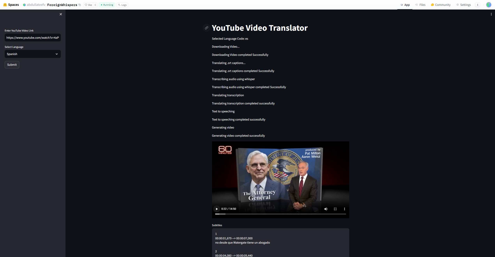
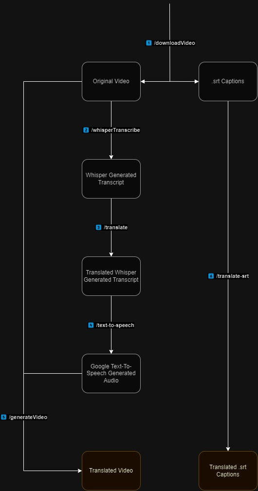

# Description
Full-Stack Streamlit UI / Flask API Application that uses Whisper ML and Google Text-To-Speech (gTTS) to translate Youtube videos and their captions into other languages for accessibilty

# HuggingFace Demo Space
**[Try it](https://abdullateefv-foreignwhispers.hf.space)**

# API Flow Diagram

